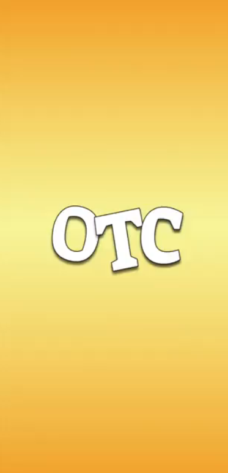
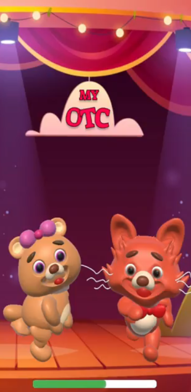
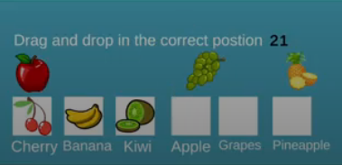
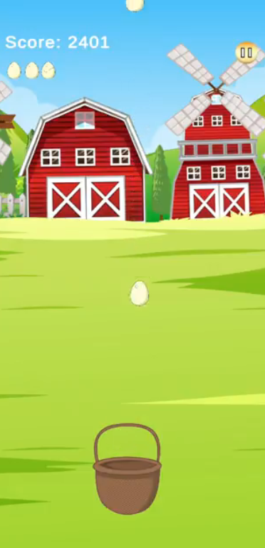

# Observing Tutoring Companion (OTC)

**Offline facial expression recognition for personalized learning and entertainment**

OTC is a mobile application that uses machine learning to detect and classify a child’s facial expressions instantly via the selfie camera. Based on the detected mood, it dynamically selects and launches appropriate activities — from educational games to cartoons — creating a more engaging experience.

> 🎓 **This project was developed as my graduation project at the Faculty of Engineering, Alexandria University.**

## Features

- **Face Detection Module** — built with Google ML Kit for fast and reliable on-device face detection, fully integrated with Android Studio (Java).
- **Facial Expression Classification Module** — uses a pre-trained model to classify the child’s mood locally, without sending any data to a server. Runs natively within the Android Java environment.
- **Dynamic Content Launcher** — activities and games are built using the Unity game engine and seamlessly integrated into the Android app to launch fun, mood based content dynamically.

## Prerequisites

- **Android Studio**
- A device or emulator with a **front-facing camera**

## Installation

1. Clone this repository.
2. Open the project in Android Studio.
3. Build and run the project on:
   - A physical Android device.
   - An emulator.

## Usage Flow

1. **Launch the App** — the front facing camera activates automatically.
2. **Grant Camera Permission** — the app needs access to the selfie camera.
3. **Face Detection** — the ML Kit module detects the face in realtime.
4. **Expression Classification** — TensorFlow Lite classifies the facial expression on device.
5. **Dynamic Activity** — based on the detected expression, an appropriate cartoon, educational game or fun activity launches instantly.

## Screenshots

| Splash Screen                              | Loading Screen                            | Character Selection                                 | Educational Game                                | Fun Game                                |
| ------------------------------------------ | ----------------------------------------- | --------------------------------------------------- | ----------------------------------------------- | --------------------------------------- |
|  |  |  |  |  |

---

## Note on UI Design

This project was developed by software engineering students with a primary focus on ML integration, Android development and game engine interaction. As such, the user interface design may not be production level or highly polished, our goal was to demonstrate technical abilities and functionality under tight academic deadlines.

---

## License

MIT License

Copyright (c) 2023 Moataz Mohamed

Permission is hereby granted, free of charge, to any person obtaining a copy
of this software and associated documentation files (the “Software”), to deal
in the Software without restriction, including without limitation the rights
to use, copy, modify, merge, publish, distribute, sublicense, and/or sell
copies of the Software, and to permit persons to whom the Software is
furnished to do so, subject to the following conditions:

The above copyright notice and this permission notice shall be included in
all copies or substantial portions of the Software.

THE SOFTWARE IS PROVIDED “AS IS”, WITHOUT WARRANTY OF ANY KIND, EXPRESS OR
IMPLIED, INCLUDING BUT NOT LIMITED TO THE WARRANTIES OF MERCHANTABILITY,
FITNESS FOR A PARTICULAR PURPOSE AND NONINFRINGEMENT. IN NO EVENT SHALL THE
AUTHORS OR COPYRIGHT HOLDERS BE LIABLE FOR ANY CLAIM, DAMAGES OR OTHER
LIABILITY, WHETHER IN AN ACTION OF CONTRACT, TORT OR OTHERWISE, ARISING FROM,
OUT OF OR IN CONNECTION WITH THE SOFTWARE OR THE USE OR OTHER DEALINGS IN THE
SOFTWARE.

---

## Acknowledgements

- Developed as part of my graduation project at **Faculty of Engineering, Alexandria University**.
- Powered by [Google ML Kit](https://developers.google.com/ml-kit), [TensorFlow Lite](https://www.tensorflow.org/lite), and [Unity](https://unity.com/).

**Thank you for checking out OTC!**
